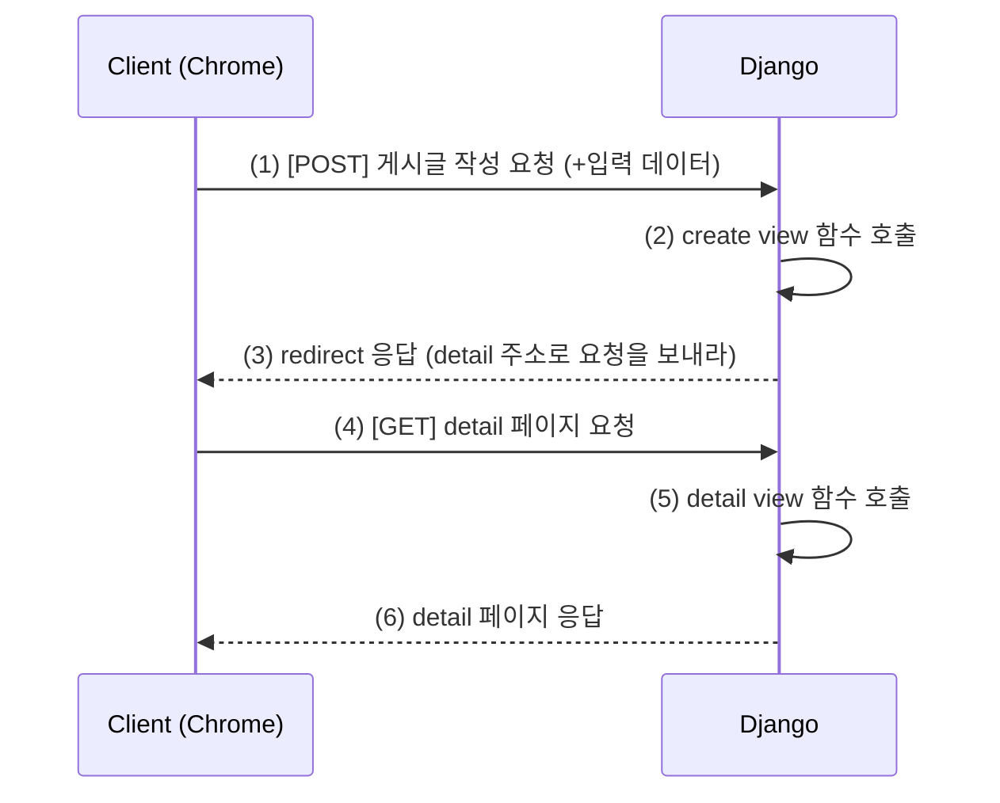

#### 📘 ORM with View 정리노트

[TOC]

# Read

------

#### 1. 핵심 흐름

- Django의 **ORM (Object Relational Mapping)**을 **View 함수에서 직접 활용**하는 단계
- **CRUD(생성, 조회, 수정, 삭제)** 중 이번 학습의 핵심은 **조회(READ)**
  - **전체 게시글 조회**
  - **단일 게시글 조회 (상세 페이지)**

------

#### 2. 데이터의 흐름

1. **요청 (Request)** → 사용자가 `/articles/` 또는 `/articles/1/` 요청
2. **URLconf (urls.py)** → 요청을 **View 함수**로 라우팅
3. **View (views.py)** → ORM을 사용해 DB에서 데이터 조회
4. **Template (HTML)** → View가 전달한 데이터를 출력

------

#### 3. 전체 게시글 조회 구현 순서

##### (1) 프로젝트 URL 설정 (`project/urls.py`)

```python
from django.urls import path, include # include 추가

urlpatterns = [
		path('admin/', admin.site.urls),
    path("articles/", include("articles.urls")), # 추가
]
```

##### (2) 앱 URL 설정 (`articles/urls.py`)

```python
from django.urls import path 
from . import views # 명시적 상대경로

app_name = 'articles' # app 이름 지정

urlpatterns = [
    path("", views.index, name="index"),
]
```

##### (3) View 함수 (`articles/views.py`)

```python
from django.shortcuts import render
from .models import Article 

# 전체 게시글 조회(1) 후 메인 페이지 응답(2)
def index(request):
    # 1. DB에 전체 게시글을 조회
    articles = Article.objects.all()

    # 2. 전체 게시글 목록을 템플릿과 함께 응답
    context = {
        'articles': articles,
    }
    return render(request, 'articles/index.html', context)
```

##### (4) Template (`articles/templates/articles/index.html`)

```html
 <body>
  <h1>메인 페이지</h1>
  <hr>
   전체 게시글 출력 
  
    <p>글 번호: {{ article.pk }}</p>
    <p>글 제목: <a href="">{{ article.title }}</a></p>
    <p>글 내용: {{ article.content }}</p>
    <hr>
  
  
  # 추가
  <form action="">
    <label for="new" value="작성하기">새로운 글 작성하기</label>
    <input type="submit" >
  </form>
</body>
```

✅ **핵심 요약**

- `Article.objects.all()` → QuerySet 전체 조회
- `context` → 템플릿에 전달할 데이터 딕셔너리
- `` → DTL 반복문 사용

------

#### 4. 단일 게시글 조회 구현 순서

##### (1) URLconf (`articles/urls.py`)

```python
urlpatterns = [
    path("", views.index, name="index"),
    path("<int:pk>/", views.detail, name="detail"), # 추가
]
```

##### (2) View 함수 (`articles/views.py`)

```python
def detail(request, pk):
    """특정 pk(Primary Key)를 가진 게시글 하나를 조회하여 detail.html 페이지를 렌더링"""
    # 1. URL로부터 전달받은 pk 값을 사용하여, 해당 pk를 가진 Article 객체 하나를 조회
    article = Article.objects.get(pk=pk)

    # 2. 조회된 단일 게시글 객체를 context에 담아 템플릿에 전달
    context = {
        'article': article,
    }
    # 3. detail.html 템플릿을 렌더링
    return render(request, 'articles/detail.html', context)
```

##### (3) Template (`articles/templates/articles/detail.html`)

```html
<h2>{{ article.pk }}번 글</h2>
<hr>
<p>제목: {{ article.title }}</p>
<p>내용: {{ article.content }}</p>
<p>작성일: {{ article.created_at }}</p>
<p>수정일: {{ article.updated_at }}</p>
<hr>
<a href="">Back</a>
```

✅ **핵심 요약**

- `get(pk=pk)` → 단일 객체 조회 (없으면 오류 발생)
- URL의 `<int:pk>` 값이 View 함수의 매개변수로 전달됨
- `urls.py`와 `views.py`의 매개변수명(pk)은 반드시 일치해야 함

------

#### 5. ORM 핵심 개념 정리

- `objects.all()` → 모든 레코드 조회
- `objects.get(pk=1)` → 단일 레코드 조회
- `objects.filter(title="제목")` → 조건 조회
- `objects.create()` → 새 데이터 생성
- `objects.update()` → 데이터 수정
- `objects.delete()` → 데이터 삭제

------

#### 6. Variable Routing (가변 라우팅)

- URL의 일부를 **변수로 받아 처리**하는 기능

- 문법:

  ```python
  path("<int:pk>/", views.detail)
  ```

- `<int:pk>`의 값이 자동으로 `detail(request, pk)`에 전달됨

- DB 내 특정 객체의 **식별자(pk)** 조회 시 필수

------

#### *7. 실행 명령어 요약*

| 명령어                               | 설명                 |
| ------------------------------------ | -------------------- |
| *`python manage.py runserver`*       | *개발 서버 실행*     |
| *`python manage.py shell`*           | *Django Shell 진입*  |
| *`python manage.py makemigrations`*  | *모델 변경사항 감지* |
| *`python manage.py migrate`*         | *DB에 모델 반영*     |
| *`python manage.py createsuperuser`* | *관리자 계정 생성*   |

------

#### 8. 전체 CRUD의 구조적 사고

| 구분     | 요청 URL              | HTTP 메서드 | View 로직 | ORM           |
| -------- | --------------------- | ----------- | --------- | ------------- |
| 목록조회 | `/articles/`          | GET         | index()   | `.all()`      |
| 단일조회 | `/articles/1/`        | GET         | detail()  | `.get(pk=pk)` |
| 생성     | `/articles/create/`   | POST        | create()  | `.create()`   |
| 수정     | `/articles/1/update/` | POST        | update()  | `.update()`   |
| 삭제     | `/articles/1/delete/` | POST        | delete()  | `.delete()`   |

------

#### 9. 학습 시 주의점

- Django는 **“데이터 흐름”** 중심으로 이해해야 함
- 모든 로직은 **URL → View → Model → Template** 순으로 연결
- 복습 시 **프로젝트 생성부터 index.html까지 직접 타이핑**할 것
- `모래성식 코딩` 금지: 앞 내용이 부족하면 뒤에서 반드시 막힘

------

#### 10. 단답식 퀴즈

1. ORM이란 무엇인가?
    → **객체를 통해 데이터베이스를 조작하는 기술 (Object Relational Mapping)**
2. 전체 게시글을 조회하는 ORM 메서드는?
    → `objects.all()`
3. 단일 게시글을 조회할 때 사용하는 메서드는?
    → `objects.get(pk=pk)`
4. `path("<int:pk>/", views.detail)`의 의미는?
    → URL에 정수형 변수를 전달해 특정 게시글을 조회
5. `context`의 역할은?
    → View에서 템플릿으로 데이터 전달
6. 템플릿에서 DTL 문법으로 반복을 표현하는 구문은?
    → ` ... `
7. `render()` 함수의 세 가지 인자는?
    → `request`, `template path`, `context`
8. `app_name`을 지정하는 이유는?
    → URL 네임스페이스 구분을 위해
9. `Article.objects.get(pk=1)` 실행 시 존재하지 않으면 발생하는 예외는?
    → `DoesNotExist`
10. View 함수의 역할은?
     → 클라이언트 요청을 처리하고 적절한 응답을 반환하는 컨트롤러


---

# Create

#### 1. 핵심 개념

- Django의 **ORM을 View에서 활용해 새로운 데이터를 생성**하는 단계
- HTML의 `<form>` 태그를 통해 사용자의 입력 데이터를 서버로 전달받고,
   View에서 ORM 메서드(`.create()` 또는 `.save()`)를 통해 DB에 저장함
- **HTTP 요청 방식 구분 필수:**
  - `GET` → 빈 폼 보여주기
  - `POST` → 사용자가 입력한 데이터를 처리하기

------

#### 2. 데이터 흐름 (CREATE)

1. 사용자가 **“새 글 작성” 버튼 클릭**
2. `/articles/create/` URL로 요청 (`GET`)
3. View에서 **빈 폼 템플릿 렌더링** (`create.html`)
4. 사용자가 제목/내용 입력 후 제출 (`POST`)
5. View에서 `request.POST` 데이터 받아 ORM으로 DB에 저장
6. 저장 후 **리다이렉트(redirect)** → 상세페이지(`/articles/<pk>/`) 이동

------

#### 3. URL 설정

##### (1) `articles/urls.py`

```python
from django.urls import path
from . import views

app_name = "articles"

urlpatterns = [
    path("", views.index, name="index"),          
    path("<int:pk>/", views.detail, name="detail"), 
    path('new/', views.new, name='new'), # 추가 1
    path("create/", views.create, name="create"),    # 추가 2
]
```

------

#### 4. View 함수

##### (1) `articles/views.py`

```python
from django.shortcuts import render, redirect # 추가
from .models import Article

def new(request):
    """새로운 게시글을 작성할 수 있는 new.html 페이지를 렌더링"""
    # 사용자가 데이터를 입력할 수 있는 빈 form 페이지를 보여주는 역할만 함
    return render(request, 'articles/new.html')


def create(request):
    """사용자가 form을 통해 제출한 데이터를 DB에 저장"""
    # 1. new.html의 form에서 POST 방식으로 전송된 데이터를 추출
    #    request.POST는 form 데이터가 담긴 딕셔너리 유사 객체
    title = request.POST.get('title')
    content = request.POST.get('content')

    # 2. 추출된 데이터를 바탕으로 Article 모델의 새 인스턴스(객체)를 생성
    article = Article(title=title, content=content)
    # 3. .save() 메서드를 호출하여, 인스턴스의 데이터를 DB 테이블에 실제로 저장
    article.save()

    # 4. 데이터 저장이 완료된 후, 사용자를 방금 생성된 게시글의 상세 페이지로 이동시킴
    #    redirect는 클라이언트에게 "이 URL로 다시 요청해 줘!"라고 지시하는 응답
    #    'articles:detail'은 articles 앱의 detail이라는 이름의 URL을 의미
    return redirect('articles:detail', article.pk)
```

------

#### 5. Template 작성

##### (1) `articles/templates/articles/new.html`

```html
  <h1>New</h1>
  <form action="" method="POST">
    
    <div>
      <label for="title">Title: </label>
      <input type="text" name="title" id="title">
    </div>
    <div>
      <label for="content">Content: </label>
      <textarea name="content" id="content"></textarea> # textarea
    </div>
    <input type="submit">
  </form>
```

##### (1) `articles/templates/articles/create.html`

```html
  <h1>게시글이 생성 되었습니다.</h1>
```

✅ **핵심 포인트**

- `method="POST"` → 서버에 데이터를 전달할 때 필수
- `` → Django의 보안 토큰 (CSRF 공격 방지)
- `request.POST.get("필드명")` → form 입력 데이터 추출
- `Article.objects.create()` → DB에 새로운 레코드 저장
- `redirect("articles:detail", article.pk)` → 생성 후 상세페이지로 이동

------

#### 6. 전체 흐름 시각화



------

#### 7. ORM 관련 메서드 정리

| 메서드      | 설명                           | 예시                                                   |
| ----------- | ------------------------------ | ------------------------------------------------------ |
| `.create()` | 인스턴스 생성 + 저장 (한 번에) | `Article.objects.create(title="제목", content="내용")` |
| `.save()`   | 인스턴스 생성 후 나중에 저장   | `a = Article(title="제목"); a.save()`                  |
| `.get()`    | 단일 객체 조회                 | `Article.objects.get(pk=1)`                            |
| `.all()`    | 전체 객체 조회                 | `Article.objects.all()`                                |

------

#### 8. redirect() 함수

- **정의:** 요청이 끝난 후 특정 URL로 이동시키는 함수

- **형식:** `return redirect("앱이름:url이름", 인자)`

- **예시:**

  ```python
  return redirect("articles:detail", article.pk)
  ```

- 내부적으로 `HttpResponseRedirect` 객체를 반환

------

#### 9. form과 POST의 관계 정리

| 구분       | 설명                                              |
| ---------- | ------------------------------------------------- |
| GET        | 서버로부터 페이지를 **조회** (데이터 변경 없음)   |
| POST       | 서버로 **데이터를 전송** (DB에 변화 발생)         |
| form 태그  | `action`(보낼 URL) + `method`(요청 방식)으로 구성 |
| csrf_token | Django에서 POST 요청 시 보안을 위한 필수 태그     |

------

#### 10. 전체 CRUD 구성도 (현재까지)

| 기능     | URL                 | View 함수  | ORM           | Template      |
| -------- | ------------------- | ---------- | ------------- | ------------- |
| 전체조회 | `/articles/`        | `index()`  | `.all()`      | `index.html`  |
| 단일조회 | `/articles/<pk>/`   | `detail()` | `.get(pk=pk)` | `detail.html` |
| 생성     | `/articles/create/` | `create()` | `.create()`   | `create.html` |

------

#### *11. 테스트 명령어*

```bash
python manage.py runserver
python manage.py migrate
python manage.py createsuperuser
```

✅ **주의:** DB를 초기화한 경우 `python manage.py migrate`를 반드시 실행해야 함.

------

#### 12. 학습 팁

- CRUD의 **데이터 흐름을 몸에 익히는 것이 핵심**이다.
- GET/POST 구분을 완벽히 이해하면 이후 Form Class, ModelForm 학습이 훨씬 쉬워진다.
- `create → redirect → detail` 흐름을 최소 3회 이상 직접 타이핑 연습할 것.

------

#### 13. 단답식 퀴즈

1. `create()` 함수에서 GET 요청과 POST 요청의 차이는?
    → **GET은 폼 표시, POST는 데이터 저장**
2. 사용자가 입력한 폼 데이터를 가져오는 코드?
    → `request.POST.get("필드명")`
3. ORM으로 새로운 데이터를 생성하는 메서드는?
    → `Article.objects.create()`
4. 데이터 저장 후 다른 페이지로 이동시키는 함수는?
    → `redirect()`
5. CSRF 공격 방지를 위한 Django 템플릿 태그는?
    → ``
6. `redirect("articles:detail", article.pk)`의 의미는?
    → 새로 생성된 글의 상세페이지로 이동
7. View에서 HTML을 렌더링할 때 사용하는 함수는?
    → `render(request, "template.html", context)`
8. form 태그의 필수 속성 두 가지는?
    → `action`, `method`
9. `request.method == "POST"` 구문은 왜 필요한가?
    → 요청이 데이터 생성 요청인지 구분하기 위해
10. `Article.objects.create()`와 `.save()`의 차이점은?
     → `.create()`는 생성+저장을 한 번에, `.save()`는 두 단계를 분리


---

# Delete

#### 1. 핵심 개념

- 특정 게시글을 **DB에서 삭제**하는 기능
- 삭제는 **POST 요청**으로만 처리해야 함 (URL 클릭만으로 삭제되면 위험하니까)
- 삭제 후에는 **메인 페이지(index)** 로 리다이렉트

------

#### 2. URL 설정

```python
# articles/urls.py
from django.urls import path
from . import views

app_name = "articles"

urlpatterns = [
    path("", views.index, name="index"),
    path("<int:pk>/", views.detail, name="detail"),
    path("create/", views.create, name="create"),
    path("<int:pk>/delete/", views.delete, name="delete"),  # 삭제
]
```

------

#### 3. View 함수

```python
# articles/views.py
def delete(request, pk):
    """특정 pk를 가진 게시글을 DB에서 삭제"""
    # 1. 삭제할 게시글을 pk를 이용해 조회
    article = Article.objects.get(pk=pk)

    # 2. 조회된 객체의 .delete() 메서드를 호출하여, DB에서 해당 레코드를 삭제(DELETE)
    article.delete()

    # 3. 게시글 삭제 후, 전체 목록 페이지로 이동
    return redirect('articles:index')
```

✅ **핵심 요약**

- `get_object_or_404()` : 존재하지 않는 객체일 때 404 에러 자동 처리
- `.delete()` : DB에서 해당 객체 삭제
- `redirect("articles:index")` : 삭제 후 목록으로 이동

------

#### 4. Template 버튼 추가

`detail.html`에 삭제 버튼 추가:

```python
<form action="" method="POST">
  
  <input type="submit" value="삭제">
</form>
```

✅ **보안 포인트**

- 삭제는 반드시 `POST` + `` 조합으로
   (`GET` 요청만으로 삭제되면 악성 링크에 노출될 수 있음)

------

#### 5. 전체 흐름 요약

```
[사용자 클릭: 삭제버튼]
      ↓
 (POST /articles/1/delete/)
      ↓
 views.delete() 실행
      ↓
 article.delete() → DB 삭제
      ↓
 redirect("articles:index")
```

------

#### 6. 단답식 퀴즈

1. ORM에서 객체를 삭제하는 메서드는? → `.delete()`
2. 삭제 후 보통 어디로 이동하나? → 메인페이지(`index`)
3. 삭제 요청은 왜 GET이 아닌 POST로 해야 하나? → 보안상 안전하게 처리하기 위해
4. 존재하지 않는 객체를 처리할 때 사용하는 함수는? → `get_object_or_404()`

------

> ✅ 요약 한 줄
>  **삭제(Delete)**는 “특정 객체를 POST 요청으로 안전하게 제거하고 목록 페이지로 리다이렉트” 하는 간단한 단계다.


---

# Update

#### 1. 핵심 개념

- 기존 게시글 데이터를 **조회 + 수정 후 저장**
- `GET` 요청 → 기존 데이터가 채워진 **수정 폼** 보여주기
- `POST` 요청 → 입력된 새 데이터로 DB 업데이트
- 수정 후 → 해당 게시글의 상세페이지(`detail`)로 리다이렉트

------

#### 2. URL 설정

```python
# articles/urls.py

urlpatterns = [
    path("<int:pk>/update/", views.update, name="update"),
    path('<int:pk>/edit/', views.edit, name='edit'),
]
```

------

#### 3. View 함수

```python
# articles/views.py

def edit(request, pk):
    """기존 게시글을 수정할 수 있는 edit.html 페이지를 렌더링"""
    # 1. 수정할 게시글의 기존 데이터를 pk를 이용해 조회
    article = Article.objects.get(pk=pk)

    # 2. 조회된 데이터를 form에 미리 채워넣기 위해 context에 담아 템플릿에 전달
    context = {
        'article': article,
    }
    # 3. edit.html 템플릿을 렌더링
    return render(request, 'articles/edit.html', context)


def update(request, pk):
    """사용자가 form을 통해 제출한 수정 데이터를 DB에 반영(UPDATE)"""
    # 1. 수정할 게시글을 pk를 이용해 조회
    article = Article.objects.get(pk=pk)

    # 2. edit.html의 form에서 POST 방식으로 전송된 새로운 데이터를 추출
    title = request.POST.get('title')
    content = request.POST.get('content')

    # 3. 조회된 인스턴스의 필드 값을 새로운 데이터로 덮어씀
    article.title = title
    article.content = content
    # 4. .save() 메서드를 호출하여, 변경된 내용을 DB에 실제로 반영(UPDATE)
    article.save()

    # 5. 수정이 완료된 후, 해당 게시글의 상세 페이지로 이동
    return redirect('articles:detail', article.pk)
```

✅ **핵심 요약**

- `article = get_object_or_404(Article, pk=pk)` → 수정할 대상 불러오기
- `article.save()` → DB에 변경사항 반영
- **create()와 다른 점:** 기존 객체를 수정한다는 것뿐

------

#### 4. Template 작성

##### `articles/templates/articles/edit.html`

```html
<body>
  <h1>Edit</h1>
  <form action="" method="POST">
    
    <div>
      <label for="title">Title: </label>
      <input type="text" name="title" id="title" value="{{ article.title }}">
    </div>
    <div>
      <label for="content">Content: </label>
      <textarea name="content" id="content">{{ article.content }}</textarea>
    </div>
    <input type="submit">
  </form>
  <hr>
  <a href="">[메인 페이지로]</a>
</body>
```

------

#### 5. detail.html에 수정 버튼 추가

```html
<a href="">수정하기</a>
```

------

#### 6. 전체 흐름 요약

```
[사용자 클릭: 수정 버튼]
      ↓ (GET)
update() → 기존 데이터가 채워진 폼 렌더링
      ↓ (POST)
폼 제출 → 수정된 데이터 저장
      ↓
redirect("articles:detail", article.pk)
```

------

#### 7. 단답식 퀴즈

1. 기존 객체를 불러올 때 사용하는 함수는? → `get_object_or_404()`
2. 수정 요청을 구분하기 위한 조건문은? → `if request.method == "POST"`
3. 데이터를 실제로 DB에 반영하는 메서드는? → `.save()`
4. 수정 완료 후 리다이렉트하는 URL은? → `detail` 페이지
5. `create()`와 `update()`의 공통점은? → 모두 `POST`로 데이터를 받아 DB에 저장

------

> ✅ 요약 한 줄
>  **Update는 “기존 객체를 불러와 수정하고 저장한 뒤 detail로 리다이렉트” 하는 과정이며, create의 구조를 거의 그대로 따른다.**