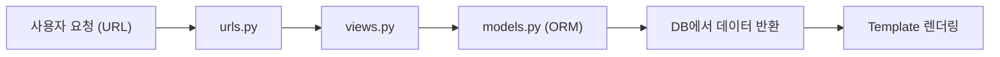

#### 1. ORM과 View의 관계

- **ORM**: DB의 데이터를 **Python 객체로 관리**
- **View**: 사용자의 요청(Request)에 따라 데이터를 **처리 및 응답(Response)**
- 즉, ORM이 데이터를 **조회/생성/삭제**하고, View는 그 결과를 **화면에 전달(render)** 함

```python
# articles/views.py
from django.shortcuts import render
from .models import Article

def index(request):
    articles = Article.objects.all()  # ORM으로 데이터 가져오기
    context = {'articles': articles}
    return render(request, 'articles/index.html', context)
```

------

#### 2. MTV 구조 복습

| 구성 요소    | 역할                                      |
| ------------ | ----------------------------------------- |
| **Model**    | 데이터베이스 구조 정의 및 조작 (ORM 담당) |
| **Template** | 사용자에게 보여질 화면 (HTML)             |
| **View**     | Model과 Template 연결 (데이터 흐름 제어)  |

📌 핵심 요약:

> **Model은 데이터 / View는 로직 / Template은 화면**

------

#### 3. 데이터 흐름(요청~응답 전체 과정)

1. 사용자가 URL 요청
2. `urls.py`에서 해당 요청을 View 함수로 전달
3. View 함수에서 ORM으로 Model 데이터를 조회
4. Template으로 데이터를 전달하여 화면에 렌더링



------

#### 4. 전체 파일 구조 예시

```
articles/
 ├── models.py
 ├── views.py
 ├── urls.py
 └── templates/
      └── articles/
           ├── index.html
           └── detail.html
```

------

#### 5. View에서 ORM 활용하기

##### (1) 전체 데이터 조회 (READ)

```python
def index(request):
    articles = Article.objects.all()  # QuerySet 반환
    context = {'articles': articles}
    return render(request, 'articles/index.html', context)
```

##### (2) 특정 데이터 조회 (상세보기)

```python
def detail(request, pk):
    article = Article.objects.get(pk=pk)
    context = {'article': article}
    return render(request, 'articles/detail.html', context)
```

------

#### 6. Template에서 데이터 출력

##### (1) 전체 목록 출력

```html
<!-- articles/index.html -->
<h1>게시글 목록</h1>

  <p>{{ article.id }} - {{ article.title }}</p>

```

##### (2) 특정 글 상세 출력

```html
<!-- articles/detail.html -->
<h1>{{ article.title }}</h1>
<p>{{ article.content }}</p>
```

------

#### 7. URL 연결 설정

##### (1) 앱 단위 URL 설정

```python
# articles/urls.py
from django.urls import path
from . import views

app_name = 'articles'
urlpatterns = [
    path('', views.index, name='index'),
    path('<int:pk>/', views.detail, name='detail'),
]
```

##### (2) 프로젝트 단위 URL 연결

```python
# config/urls.py
from django.urls import path, include

urlpatterns = [
    path('articles/', include('articles.urls')),
]
```

------

#### 8. Template 내부 링크 연결

- **`url` 템플릿 태그**를 사용하여 View로 이동

```html
<!-- articles/index.html -->
<a href="">{{ article.title }}</a>
```

------

#### 9. ORM과 View를 통한 CRUD 핵심 예시

##### CREATE (게시글 작성)

```python
# views.py
def create(request):
    if request.method == 'POST':
        title = request.POST.get('title')
        content = request.POST.get('content')
        Article.objects.create(title=title, content=content)
        return redirect('articles:index')
    return render(request, 'articles/create.html')
```

##### READ (목록 및 상세)

→ 위 index/detail 함수 참고

##### UPDATE (수정)

```python
def update(request, pk):
    article = Article.objects.get(pk=pk)
    if request.method == 'POST':
        article.title = request.POST.get('title')
        article.content = request.POST.get('content')
        article.save()
        return redirect('articles:detail', article.pk)
    context = {'article': article}
    return render(request, 'articles/update.html', context)
```

##### DELETE (삭제)

```python
def delete(request, pk):
    article = Article.objects.get(pk=pk)
    article.delete()
    return redirect('articles:index')
```

------

#### 10. Template Form 예시

```html
<!-- create.html -->
<form action="" method="POST">
  
  <input type="text" name="title" placeholder="제목">
  <textarea name="content" placeholder="내용"></textarea>
  <button type="submit">저장</button>
</form>
```

------

#### 11. HTTP 메서드 정리

| 메서드 | 설명        | Django에서의 역할  |
| ------ | ----------- | ------------------ |
| GET    | 데이터 요청 | 조회 (페이지 열기) |
| POST   | 데이터 전송 | 생성, 수정, 삭제   |

------

#### 12. ORM + View 조합 시 주의사항

- `GET` 요청일 때만 Template 렌더링
- `POST` 요청일 때 DB 조작 수행
- `redirect()` 사용 시 **URL name**을 반드시 지정할 것
- ORM의 `.get()` 사용 시 없는 pk 조회하면 오류 발생 (`DoesNotExist`)

------

#### 13. 전체 흐름 코드 요약

```python
# urls.py
path('', views.index, name='index')
path('<int:pk>/', views.detail, name='detail')

# views.py
def index(request):
    articles = Article.objects.all()
    context = {'articles': articles}
    return render(request, 'articles/index.html', context)
<!-- index.html -->

  <a href="">{{ article.title }}</a>

```

------

#### 14. 핵심 명령어 요약

| 구분         | 명령어                                   | 설명            |
| ------------ | ---------------------------------------- | --------------- |
| 서버 실행    | `python manage.py runserver`             | 개발 서버 시작  |
| 데이터 조회  | `Article.objects.all()`                  | 모든 데이터     |
| 특정 데이터  | `Article.objects.get(pk=1)`              | 단일 조회       |
| 데이터 생성  | `Article.objects.create(title, content)` | 새 글 작성      |
| 데이터 수정  | `article.save()`                         | 수정 후 저장    |
| 데이터 삭제  | `article.delete()`                       | 삭제            |
| Django Shell | `python manage.py shell`                 | ORM 직접 실습용 |
| 마이그레이션 | `python manage.py migrate`               | DB 반영         |

------

#### 15. 핵심 암기 문장

- “**View는 ORM을 이용해 데이터를 가져와 Template으로 전달한다.**”
- “**ORM은 SQL 없이 Python 문법으로 CRUD 수행을 가능하게 한다.**”
- “**GET 요청 → 조회 / POST 요청 → 데이터 변경(생성·수정·삭제)**”
- “**URL-View-Template의 흐름은 Django의 핵심 구조이다.**”

------

#### 16. 시험 대비 단답식 퀴즈

1. View 함수에서 ORM으로 데이터를 가져오는 대표 코드 한 줄은?
    → `Article.objects.all()`
2. `render()` 함수의 역할은?
    → 요청과 템플릿, context를 합쳐 HTML 응답 반환
3. Template에서 다른 페이지로 이동하는 방법은?
    → ``
4. `redirect()` 함수의 역할은?
    → 특정 URL로 이동시켜줌 (주로 POST 이후 사용)
5. View에서 `request.method == 'POST'` 조건문을 쓰는 이유는?
    → 데이터 생성/수정 등 **DB 변경 시점**을 구분하기 위함
6. ORM과 View의 결합에서 `context`의 역할은?
    → View → Template 간 데이터 전달
7. `.get(pk=1)`로 없는 데이터를 조회하면 발생하는 오류는?
    → `DoesNotExist`
8. 게시글 삭제 기능을 구현하는 ORM 메서드는?
    → `.delete()`
9. Template에서 게시글 제목을 출력하는 문법은?
    → `{{ article.title }}`
10. Django에서 MTV 구조 중 View의 역할은?
     → Model과 Template을 연결하는 **데이터 처리 및 제어 로직**