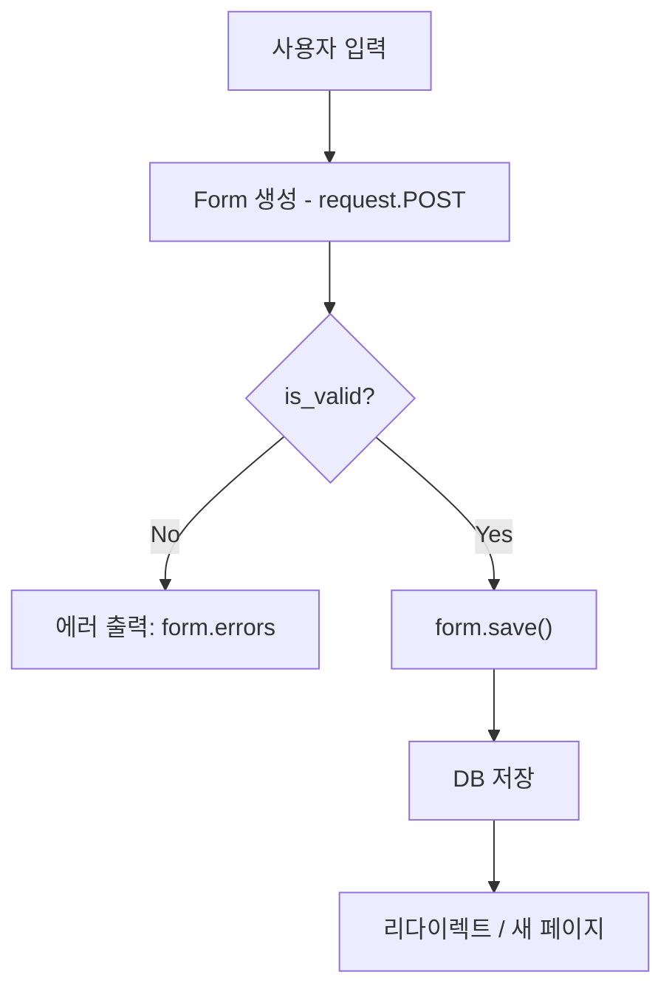

# DJango Form

[TOC]


## 1. Django Form 기본 개념 및 Widget

#### 1. HTML Form의 한계

- HTML의 `<form>` 태그는 단순히 데이터를 **입력하고 제출(action)** 하는 역할만 수행함.
- 보안, 데이터 형식 검증(Validation), 필수 항목 체크 등은 직접 구현해야 함.
- 즉, **“유효성 검사(Validation)”** 기능이 없음.

#### 2. Django Form의 등장 배경

- Django의 `Form` 클래스는 HTML form 기능을 **확장**하여 다음을 자동 처리:
  - 입력 데이터 수집
  - 유효성 검사 (Validation)
  - 에러 메시지 관리
  - HTML input 자동 렌더링

#### 3. Django Form의 기본 구조

1️⃣ `forms.py` 생성
 (없다면 직접 생성해야 함)

```
# articles/forms.py
from django import forms

class ArticleForm(forms.Form):
    title = forms.CharField(max_length=10)
    content = forms.CharField(max_length=200)
```

2️⃣ View에서 Form을 import

```
from .forms import ArticleForm

def new(request):
    form = ArticleForm()
    return render(request, "articles/new.html", {"form": form})
```

3️⃣ Template에서 사용

```
<form method="POST">
  
  {{ form.as_p }}
  <input type="submit" value="제출">
</form>
```

→ `{{ form.as_p }}` : 각 필드를 `<p>` 단위로 자동 렌더링.

------

#### 4. Form 클래스의 역할

- Django Form은 **HTML input 태그 집합을 자동 생성**한다.
- HTML `<form>` 태그 자체를 대체하지 않음.
- 대체되는 것은 내부의 `<input>`, `<label>`, `<textarea>` 등 입력 영역이다.

📌 **Form이 하는 일**

- 사용자의 입력 데이터 수집
- 데이터 형식 검증 (예: 이메일 형식, 빈 값 금지 등)
- 검증 실패 시 에러 메시지 표시
- 검증 성공 시 View로 전달되어 DB 저장 혹은 다른 처리

------

#### 5. Field의 종류 비교

| 구분      | 모델(Model)                     | 폼(Form)                                 |
| --------- | ------------------------------- | ---------------------------------------- |
| import    | `from django.db import models`  | `from django import forms`               |
| 예시      | `models.CharField()`            | `forms.CharField()`                      |
| 목적      | DB 컬럼 정의                    | 사용자 입력 정의                         |
| 저장 여부 | DB에 저장                       | DB와 무관함                              |
| 예외 필드 | `TextField`, `DateTimeField` 등 | `Textarea`, `DateInput`, `EmailField` 등 |

> 즉, 이름이 같아도 `models.CharField`와 `forms.CharField`는 **완전히 다른 클래스**임.

------

#### 6. Widget의 개념

- 위젯(widget)은 **입력 필드의 시각적 표현**을 담당하는 속성.
- 즉, “이 필드를 어떤 HTML 태그로 표현할지” 결정.

```
class ArticleForm(forms.Form):
    title = forms.CharField(max_length=10)
    content = forms.CharField(widget=forms.Textarea)
```

- 위 예시에서 `widget=forms.Textarea`는 `content` 필드를 `<textarea>`로 렌더링함.
- `widget` 종류 예:
  - `TextInput`
  - `Textarea`
  - `PasswordInput`
  - `CheckboxInput`
  - `Select`
  - `DateInput`, `TimeInput` 등

> ⚙️ 위젯은 데이터 형식이 아니라 **표현(View)** 을 바꾸는 역할.

------

#### 7. Form의 HTML 출력 특징

- `{{ form.as_p }}` 사용 시:
  - 각 필드가 `<div>`로 자동 감싸짐.
  - `<label>` 태그 자동 생성.
  - `name`, `id`, `maxlength` 등 속성 자동 반영.
- 예시 출력:

```
<div>
  <label for="id_title">Title:</label>
  <input type="text" name="title" maxlength="10" required id="id_title">
</div>
```

------

#### 8. Django Form의 유효성 검사 흐름 (preview)

1. 사용자가 데이터를 입력하고 제출
2. Django는 Form 객체 생성 시 전달된 데이터를 검증 (`is_valid()`)
3. 검증 실패 시 → `form.errors` 로 에러 표시
4. 검증 성공 시 → `form.cleaned_data` 로 안전하게 접근 가능

------

### 🔑 핵심 요약

- Django Form은 **HTML input을 자동으로 생성하고 Validation을 수행**한다.
- `forms.Form` 클래스는 DB와는 독립적이다.
- **HTML `<form>`은 여전히 존재**, 단 내부 input을 Django가 자동 관리한다.
- 위젯(widget)은 “어떻게 보여질지”를 제어한다.
- 이 장은 Django 코드 구조가 본격적으로 바뀌는 **첫 번째 분기점**이다.

------

### 🧩 핵심 명령어 & 코드 요약

| 구분             | 코드 / 명령어                            | 설명                                   |
| ---------------- | ---------------------------------------- | -------------------------------------- |
| Form 모듈 import | `from django import forms`               | Django Form 기능 사용                  |
| Form 클래스 정의 | `class ArticleForm(forms.Form):`         | 사용자 입력 필드 정의                  |
| 필드 선언        | `forms.CharField(max_length=10)`         | 문자열 입력 필드                       |
| 위젯 지정        | `forms.CharField(widget=forms.Textarea)` | 입력창 타입 변경                       |
| View 연결        | `form = ArticleForm()`                   | 인스턴스 생성                          |
| Template 출력    | `{{ form.as_p }}`                        | 자동 HTML 렌더링                       |
| 위젯 변경        | `widget=forms.PasswordInput`             | HTML `<input type="password">` 로 표시 |

------

### 🧠 단답식 퀴즈

1. **HTML `<form>` 태그의 한계는 무엇인가요?**
    → 유효성 검사를 수행하지 못한다.
2. **Django Form의 주요 목적은?**
    → 사용자 입력 데이터를 수집하고 자동으로 유효성 검사를 수행한다.
3. **Form 클래스는 어디에 작성하나요?**
    → `forms.py`
4. **Form이 대체하는 것은 `<form>` 태그 전체일까?**
    → 아니요, 내부의 input 요소만 대체한다.
5. **`forms.CharField()`와 `models.CharField()`의 차이점은?**
    → 전자는 사용자 입력용, 후자는 DB 스키마용이다.
6. **Widget이란 무엇인가요?**
    → 필드가 화면에 어떤 형태로 보여질지를 제어하는 표현 도구.
7. **Form의 자동 렌더링 메서드 `{{ form.as_p }}`는 무엇을 의미하나요?**
    → 각 필드를 `<p>` 단위로 자동 생성해주는 Django 템플릿 문법이다.

------


## 2. ModelForm과 Meta 클래스

#### 1. Form과 ModelForm의 차이

| 구분         | Form                          | ModelForm                                       |
| ------------ | ----------------------------- | ----------------------------------------------- |
| 입력 데이터  | 사용자 입력을 수집            | 사용자 입력을 수집                              |
| DB 저장 여부 | 직접 저장 X                   | 자동으로 DB에 저장 가능                         |
| 사용 목적    | 검색, 로그인 등 “임시 데이터” | 회원가입, 게시글 작성 등 “DB에 저장되는 데이터” |
| 코드 작성    | 모든 필드를 직접 정의         | 모델 구조를 기반으로 자동 생성                  |
| 상속 클래스  | `forms.Form`                  | `forms.ModelForm`                               |

> ✅ 한마디로:
>  **Form은 수집용, ModelForm은 수집 + 저장용**

------

#### 2. ModelForm의 필요성

- Form을 이용해 모든 필드를 일일이 작성하면 **반복 코드**가 많아짐.
- 특히 입력 필드가 10개 이상이면 유지보수가 어려움.
- ModelForm은 모델 구조를 알고 있으므로, **필드를 자동 생성**함.

------

#### 3. ModelForm 기본 구조

```
# articles/forms.py
from django import forms
from .models import Article

class ArticleForm(forms.ModelForm):
    class Meta:
        model = Article
        fields = '__all__'
```

#### 구조 분석

- `ArticleForm`은 `forms.ModelForm`을 상속받음.
- 내부에 **Meta 클래스** 존재:
  - `model`: 연결할 모델 지정 (여기선 `Article`)
  - `fields`: 사용할 모델 필드 지정
    - `'__all__'` → 모델의 모든 필드 사용
    - `['title', 'content']` → 특정 필드만 선택 가능

------

#### 4. Meta 클래스의 역할

- Meta는 “메타데이터(metadata)”를 저장하는 공간.
- 즉, **ModelForm에 대한 부가 정보**를 정의하는 곳.
- 파이썬 문법의 “내부 클래스”와는 무관함.
   → 단순히 Django 개발자들이 “정보를 깔끔하게 묶어두기 위해” 만든 구조임.

예시:

```
class ArticleForm(forms.ModelForm):
    class Meta:
        model = Article
        fields = ['title', 'content']
```

- `Meta.model` → 어떤 모델과 연결할지 지정
- `Meta.fields` → 어떤 필드를 폼에 포함할지 지정

------

#### 5. ModelForm의 자동화된 동작

- `model = Article`을 지정하면 Django는 다음을 자동 수행:
  1. `Article` 모델의 필드를 읽고,
  2. 필드명, 데이터타입, 제약조건(`max_length` 등)을 인식하고,
  3. 각 필드에 맞는 Form Field를 자동 생성한다.

즉, 아래의 코드는…

```
class ArticleForm(forms.ModelForm):
    class Meta:
        model = Article
        fields = ['title', 'content']
```

…이 코드와 **같은 결과를 자동으로 만든다**👇

```
class ArticleForm(forms.Form):
    title = forms.CharField(max_length=10)
    content = forms.CharField(widget=forms.Textarea)
```

------

#### 6. ModelForm 사용 흐름

1️⃣ **폼 출력 (GET 요청)**

```
def new(request):
    form = ArticleForm()
    return render(request, "articles/new.html", {"form": form})
```

2️⃣ **데이터 제출 (POST 요청)**

```
def create(request):
    form = ArticleForm(request.POST)
    if form.is_valid():
        form.save()  # ✅ 자동 DB 저장
        return redirect("articles:index")
    return render(request, "articles/new.html", {"form": form})
```

✅ 핵심 포인트:

- `is_valid()` : 유효성 검사 수행
- `form.save()` : DB에 자동 저장
- 검증 실패 시 `form.errors`로 템플릿에 에러 전달

------

#### 7. fields 옵션 정리

| 값                         | 설명                  |
| -------------------------- | --------------------- |
| `__all__`                  | 모델의 모든 필드 포함 |
| `['title', 'content']`     | 특정 필드만 포함      |
| `exclude = ['created_at']` | 제외할 필드 명시      |

예:

```
class Meta:
    model = Article
    exclude = ['created_at', 'updated_at']
```

------

#### 8. 유효성 검사 (Validation) 요약

- Django는 `ModelForm`에서도 `is_valid()`를 통해 자동으로 검증함.
- 검증 단계:
  1. 데이터가 필드 타입과 일치하는지 확인
  2. 모델에서 설정한 제약조건(`max_length`, `blank`, `unique` 등)을 확인
  3. 문제 없으면 `cleaned_data`에 안전한 값 저장

예:

```
if form.is_valid():
    data = form.cleaned_data
    print(data['title'])
```

------

#### 9. form.save() 작동 방식

`form.save()`는 내부적으로 다음 단계를 수행함:

```
# 내부적으로 다음 코드와 동일하게 동작
article = form.save(commit=False)
article.save()
```

- `commit=False` : DB에 즉시 저장하지 않고 인스턴스만 반환
   → 저장 전 추가 작업 가능 (ex: 작성자 정보 추가)
- `commit=True` : 기본값. 바로 DB에 저장됨.

예:

```
form = ArticleForm(request.POST)
if form.is_valid():
    article = form.save(commit=False)
    article.user = request.user
    article.save()
```

------

#### 10. ModelForm vs Form 코드 비교 요약

| 비교 항목   | Form                    | ModelForm                     |
| ----------- | ----------------------- | ----------------------------- |
| 부모 클래스 | `forms.Form`            | `forms.ModelForm`             |
| Meta 클래스 | ❌ 없음                  | ✅ 필수                        |
| model 연결  | 수동 정의               | 자동 연결                     |
| DB 저장     | 수동(`instance.save()`) | 자동(`form.save()`)           |
| 유효성 검사 | `is_valid()`            | `is_valid()` (모델 제약 포함) |
| 필드 정의   | 직접 작성               | 자동 생성 가능                |

------

#### 11. ModelForm의 장점 요약

- 코드 간결화 (필드 자동 생성)
- 모델의 제약조건 자동 반영 (`max_length`, `unique`, `blank`)
- DB 저장까지 일관된 흐름 (`form.save()`)
- 유지보수성 향상 (모델 구조 바뀌면 Form도 자동 반영)

------

### 🧩 핵심 명령어 & 코드 요약

| 구분           | 코드 / 명령어                      | 설명                     |
| -------------- | ---------------------------------- | ------------------------ |
| 모델 폼 상속   | `class FormName(forms.ModelForm):` | ModelForm 선언           |
| 모델 연결      | `model = Article`                  | 연결할 모델 지정         |
| 필드 지정      | `fields = '__all__'`               | 모든 필드 사용           |
| 필드 일부 선택 | `fields = ['title', 'content']`    | 일부만 선택              |
| 저장           | `form.save()`                      | DB 저장                  |
| 임시 저장      | `form.save(commit=False)`          | DB 저장 전 인스턴스 반환 |
| 검증           | `form.is_valid()`                  | 유효성 검사 수행         |
| 검증 후 접근   | `form.cleaned_data['title']`       | 안전한 데이터 접근       |

------

### 🧠 단답식 퀴즈

1. **ModelForm의 가장 큰 특징은?**
    → 모델의 필드를 기반으로 Form을 자동 생성하고 DB 저장이 가능하다.
2. **`Meta` 클래스는 왜 필요한가요?**
    → 어떤 모델과 필드를 사용할지 지정하기 위해.
3. **`form.save()`가 내부적으로 수행하는 동작은?**
    → 인스턴스 생성 후 DB에 저장 (`commit=False`로 조절 가능)
4. **`is_valid()` 메서드의 역할은?**
    → 유효성 검사 후 안전한 데이터를 `cleaned_data`에 저장한다.
5. **Form과 ModelForm의 차이를 한 줄로 말하면?**
    → Form은 “입력만”, ModelForm은 “입력 + 저장”.
6. **Meta 클래스의 `fields` 속성에 `'__all__'`을 지정하면?**
    → 모델의 모든 필드가 폼에 포함된다.
7. **ModelForm에서 유효성 검사가 가능한 이유는?**
    → 모델의 제약조건(`max_length`, `unique` 등)을 자동 인식하기 때문.

------

### 🔑 핵심 요약 문장

> **ModelForm은 Form과 Model의 결합체로, “사용자 입력 → 유효성 검사 → DB 저장”의 흐름을 자동화한다.**
>
> 즉, Django에서 데이터 입력과 저장을 가장 효율적으로 구현하는 핵심 클래스다.


## 3. Form의 유효성 검사와 View 함수 결합

#### 1. 기존 문제 상황

기존에는 **함수를 2개**로 나눠서 처리했음:

```
def new(request):
    form = ArticleForm()
    return render(request, "articles/new.html", {"form": form})

def create(request):
    title = request.POST.get("title")
    content = request.POST.get("content")
    Article.objects.create(title=title, content=content)
    return redirect("articles:index")
```

- `new()` → 빈 입력 폼 페이지 렌더링
- `create()` → 데이터 수신 및 저장
   → 하지만 이런 구조는 **중복 코드가 많고 유지보수가 불편**함.

------

#### 2. 함수 결합의 개념

Django는 GET/POST 요청을 구분하여 **하나의 View 함수로 통합**할 수 있음.

> **핵심 아이디어:**
>
> - GET 요청 → 폼 페이지 표시
> - POST 요청 → 데이터 처리 및 저장

------

#### 3. 결합된 View 예시

```
from django.shortcuts import render, redirect
from .forms import ArticleForm

def create(request):
    if request.method == "POST":
        form = ArticleForm(request.POST)
        if form.is_valid():          # ✅ 유효성 검사
            form.save()              # ✅ DB 저장
            return redirect("articles:index")
    else:
        form = ArticleForm()         # ✅ GET 요청일 경우, 빈 폼 생성

    return render(request, "articles/new.html", {"form": form})
```

------

#### 4. 코드 해석

1. **요청 구분**
   - `if request.method == "POST"` → 데이터가 제출된 상태
   - `else` → 빈 입력 폼 요청 (GET)
2. **`form.is_valid()`**
   - POST 데이터가 Form 클래스의 필드 규칙과 일치하는지 검사
   - 유효하지 않다면, `form.errors`에 자동으로 에러 메시지 저장
   - 유효하다면, `form.cleaned_data`에 정제된 데이터 저장
3. **`form.save()`**
   - ModelForm일 경우 DB에 자동 저장 수행
   - Form일 경우 수동으로 `Article.objects.create()` 필요
4. **리턴**
   - 성공 시 → `redirect("articles:index")`
   - 실패 시 → 같은 템플릿(`new.html`)로 폼 다시 렌더링

------

#### 5. 템플릿 구조 예시 (`new.html`)

```
<h1>새 게시글 작성</h1>
<form method="POST">
  
  {{ form.as_p }}
  <input type="submit" value="작성">
</form>
```

- `{{ form.as_p }}` : 필드별 `<p>` 단위 렌더링
- `{{ form.errors }}` : 검증 실패 시 에러 자동 표시 가능

------

#### 6. 유효성 검사 흐름 (전체 요약)

```
[사용자 입력] 
   ↓
Form 객체 생성 → form = ArticleForm(request.POST)
   ↓
유효성 검사 → form.is_valid()
   ↓ (통과)
DB 저장 → form.save()
   ↓
페이지 리디렉션
```

📌 이 모든 과정이 “한 줄”로 연결되는 것이 Django Form의 핵심 구조다.

------

#### 7. `is_valid()`와 `cleaned_data`

```
form = ArticleForm(request.POST)
if form.is_valid():
    print(form.cleaned_data["title"])
    print(form.cleaned_data["content"])
```

- `is_valid()` : 유효성 검사 수행
- `cleaned_data` : 유효한 데이터만 딕셔너리 형태로 저장됨
- 잘못된 데이터가 있다면, `form.errors`에 저장되어 템플릿에서 출력 가능

------

#### 8. 에러 메시지 출력 예시

```
<form method="POST">
  
  {{ form.as_p }}
  
    <ul>
      
        <li>{{ field }} : {{ errors }}</li>
      
    </ul>
  
  <input type="submit" value="작성">
</form>
```

출력 예시:

```
title : ['이 필드는 필수 항목입니다.']
```

------

#### 9. 추가 옵션 – `commit=False` 응용

DB 저장 전 데이터를 가공하고 싶을 때 사용함.

```
form = ArticleForm(request.POST)
if form.is_valid():
    article = form.save(commit=False)
    article.user = request.user
    article.save()
```

- `commit=False` → DB에 바로 저장하지 않음.
- 인스턴스를 반환받아 추가 필드 수정 가능.

------

#### 10. Form 결합 방식의 장점

| 구분      | 기존(new/create 분리) | 통합(create 결합형) |
| --------- | --------------------- | ------------------- |
| 코드 구조 | 함수 2개 필요         | 함수 1개로 통합     |
| 유지보수  | 중복 발생             | 간결하고 효율적     |
| 검증 구조 | 수동                  | 자동 (is_valid)     |
| 저장      | 직접 ORM 호출         | `form.save()` 한 줄 |
| 확장성    | 낮음                  | 높음                |

------

#### 11. Form 검증과 모델 검증의 차이

| 구분 | Form 검증           | Model 검증                |
| ---- | ------------------- | ------------------------- |
| 시점 | 요청 수신 시        | DB 저장 직전              |
| 주체 | `form.is_valid()`   | `Model.full_clean()`      |
| 대상 | 입력 필드 형식      | 모델의 모든 제약조건      |
| 결과 | `cleaned_data` 반환 | ValidationError 발생 가능 |

> 대부분의 경우 ModelForm에서 **두 검증이 통합되어 수행됨.**

------

#### 12. 전체 구조 요약 (Flow)



------

### 🧩 핵심 명령어 & 코드 요약

| 구분         | 코드 / 명령어                 | 설명                     |
| ------------ | ----------------------------- | ------------------------ |
| 요청 구분    | `if request.method == 'POST'` | GET/POST 구분 처리       |
| 검증         | `form.is_valid()`             | 유효성 검사 수행         |
| 검증 성공 시 | `form.save()`                 | DB 자동 저장             |
| 검증 실패 시 | `form.errors`                 | 에러 목록 반환           |
| 임시 저장    | `form.save(commit=False)`     | DB 반영 전 인스턴스 수정 |
| 안전 데이터  | `form.cleaned_data['title']`  | 정제된 데이터 접근       |
| 템플릿 출력  | `{{ form.as_p }}`             | HTML 자동 생성           |

------

### 🧠 단답식 퀴즈

1. **`is_valid()`의 역할은?**
    → 입력 데이터가 유효한지 검사하고 결과를 반환한다.
2. **유효성 검사를 통과한 데이터는 어디에 저장되는가?**
    → `form.cleaned_data`
3. **`commit=False`는 언제 쓰는가?**
    → DB 저장 전에 인스턴스를 수정하고 싶을 때.
4. **유효하지 않은 데이터는 어디에서 확인할 수 있는가?**
    → `form.errors`
5. **GET/POST 요청을 한 함수에서 처리할 수 있는 이유는?**
    → `request.method`로 요청 방식을 구분하기 때문이다.
6. **Form 결합 방식의 가장 큰 장점은?**
    → 코드 중복 제거와 자동 유효성 검사.
7. **`form.save()`의 내부 동작은?**
    → Model 인스턴스를 생성하고 DB에 저장한다.

------

### 🔑 핵심 요약 문장

> **Form 결합의 본질은 “데이터 수집, 검증, 저장”의 3단계를 한 함수에서 처리하는 것**이며,
>  Django의 `is_valid()`와 `save()` 메서드 덕분에 이 흐름이 매우 단순화된다.


## 4. ModelForm을 이용한 Update/Edit 기능

#### 1. 개념 요약

- `ModelForm`은 생성(create)뿐 아니라 **수정(update)** 도 처리할 수 있다.
- 핵심은 `instance` 인자를 활용해, 기존 데이터를 폼에 채워 넣는 것.

> **핵심 문장:**
>  새 글을 작성할 땐 `form = ArticleForm()`,
>  기존 글을 수정할 땐 `form = ArticleForm(instance=article)`

------

#### 2. 기존 데이터 수정 흐름

1️⃣ **사용자 요청 → 수정 페이지 이동 (GET 요청)**
 → 기존 데이터가 폼에 미리 채워져야 함.

2️⃣ **수정 내용 제출 (POST 요청)**
 → 새 값으로 기존 인스턴스를 덮어씌우고 저장.

------

#### 3. update() 함수 예시

```
from django.shortcuts import render, redirect, get_object_or_404
from .models import Article
from .forms import ArticleForm

def update(request, pk):
    article = get_object_or_404(Article, pk=pk)
    if request.method == "POST":
        form = ArticleForm(request.POST, instance=article)  # ✅ 기존 데이터 수정
        if form.is_valid():
            form.save()
            return redirect("articles:detail", article.pk)
    else:
        form = ArticleForm(instance=article)  # ✅ 기존 데이터 채워서 보여줌
    return render(request, "articles/update.html", {"form": form})
```

------

#### 4. 코드 해석

- `get_object_or_404(Article, pk=pk)`
  - 존재하지 않는 글에 접근할 경우 404 오류 자동 반환.
  - 안전한 객체 검색 방법.
- `instance=article`
  - 수정하고자 하는 기존 데이터를 `Form`에 연결.
  - 이 인스턴스의 필드 값들이 폼에 미리 채워짐.
- `form.is_valid()` 이후 `form.save()`
  - 기존 데이터(`article`)의 필드를 업데이트 후 DB 저장.

------

#### 5. HTML 템플릿 (`update.html`)

```
<h1>게시글 수정</h1>
<form method="POST">
  
  {{ form.as_p }}
  <input type="submit" value="수정하기">
</form>
```

- 기존 작성글이 자동으로 입력창에 표시됨.
- POST 요청으로 제출 시 수정 내용이 DB에 반영됨.

------

#### 6. update() 함수 동작 흐름 요약

```
flowchart TD
  A[사용자: 수정 요청] --> B[get_object_or_404()]
  B --> C{요청 메서드}
  C -->|GET| D[Form(instance=article) → 기존 데이터 표시]
  C -->|POST| E[Form(request.POST, instance=article)]
  E --> F{is_valid?}
  F -->|No| G[에러 표시]
  F -->|Yes| H[form.save() → DB 업데이트]
  H --> I[redirect(detail)]
```

------

#### 7. 핵심 비교: 새 글 작성 vs 글 수정

| 구분           | 새 글 작성                  | 기존 글 수정                                  |
| -------------- | --------------------------- | --------------------------------------------- |
| Form 객체 생성 | `ArticleForm()`             | `ArticleForm(instance=article)`               |
| POST 시        | `ArticleForm(request.POST)` | `ArticleForm(request.POST, instance=article)` |
| DB 반영        | 새 객체 생성                | 기존 객체 업데이트                            |
| redirect 대상  | index 등 목록 페이지        | detail(해당 글 페이지)                        |

------

#### 8. instance 인자의 역할

- `instance`는 Form이 수정 대상 모델 인스턴스를 알고 있게 함.
- `save()` 시 새로 생성하지 않고 **기존 객체를 갱신(update)** 함.

예시 비교:

```
# 새로운 데이터 생성
form = ArticleForm(request.POST)
form.save()

# 기존 데이터 수정
form = ArticleForm(request.POST, instance=article)
form.save()
```

> ⚠️ `instance`를 지정하지 않으면 **새 객체가 생성됨.**

------

#### 9. update와 create 함수의 구조 비교

| 단계           | create 함수                  | update 함수                                   |
| -------------- | ---------------------------- | --------------------------------------------- |
| 객체 준비      | `ArticleForm()`              | `get_object_or_404(Article, pk=pk)`           |
| 폼 생성 (GET)  | `ArticleForm()`              | `ArticleForm(instance=article)`               |
| 폼 생성 (POST) | `ArticleForm(request.POST)`  | `ArticleForm(request.POST, instance=article)` |
| 저장           | `form.save()` → 새 객체 생성 | `form.save()` → 기존 객체 수정                |
| 리다이렉트     | index                        | detail                                        |

------

#### 10. form.save()의 내부 동작 차이

```
# create()
form = ArticleForm(request.POST)
form.save()
# → Article.objects.create()

# update()
form = ArticleForm(request.POST, instance=article)
form.save()
# → article.save() (기존 객체 업데이트)
```

즉, 내부에서 `instance`의 유무로 **INSERT / UPDATE**를 구분한다.

------

#### 11. instance 응용 예시

다른 모델에서도 동일하게 사용 가능함.

예:

```
user = get_object_or_404(User, username='najung')
form = UserForm(request.POST, instance=user)
```

→ 회원정보 수정 폼 등에서 자주 사용됨.

------

#### 12. 폼 데이터 초기값 초기화 (optional)

```
form = ArticleForm(initial={'title': '제목 미리보기', 'content': '내용 템플릿'})
```

- `initial` : 새 폼을 띄울 때 기본값 설정
- `instance` : 기존 데이터로 채움
- 둘 다 가능하지만 **instance가 우선순위**가 높음

------

### 🧩 핵심 명령어 & 코드 요약

| 구분           | 코드 / 명령어                             | 설명                |
| -------------- | ----------------------------------------- | ------------------- |
| 객체 조회      | `get_object_or_404(Model, pk=pk)`         | 존재하지 않으면 404 |
| 폼 생성 (GET)  | `form = Form(instance=obj)`               | 기존 데이터 채움    |
| 폼 생성 (POST) | `form = Form(request.POST, instance=obj)` | 수정 데이터 바인딩  |
| 검증           | `form.is_valid()`                         | 유효성 검사         |
| 저장           | `form.save()`                             | 기존 데이터 수정    |
| 리디렉션       | `redirect("app:detail", obj.pk)`          | 상세 페이지로 이동  |

------

### 🧠 단답식 퀴즈

1. **`instance` 인자의 역할은 무엇인가요?**
    → 기존 인스턴스를 Form과 연결하여 수정이 가능하게 한다.
2. **`instance`를 지정하지 않으면 어떤 일이 발생하나요?**
    → 새 객체가 생성된다.
3. **수정 Form과 생성 Form의 차이는?**
    → 수정 Form에는 `instance`가 포함되어 있다.
4. **`form.save()`는 update 시 내부적으로 어떤 메서드를 호출하나요?**
    → 기존 인스턴스의 `.save()` 메서드.
5. **수정 후 일반적으로 리디렉트하는 곳은 어디인가요?**
    → 수정된 게시글의 `detail` 페이지.

------

### 🔑 핵심 요약 문장

> **`instance`는 ModelForm에서 “어떤 객체를 수정할지” 알려주는 핵심 인자이며,**
>  이를 통해 Django는 동일한 `save()` 메서드로도 새 데이터 생성과 기존 데이터 수정을 자동으로 구분한다.


#### CRUD 전체 코드 구조 예시 (정리용)

```python
# views.py

from django.shortcuts import render, redirect
from .models import Article
from .forms import ArticleForm


# CREATE
def create(request):
    if request.method == "POST":
        form = ArticleForm(request.POST)
        if form.is_valid():
            form.save()
            return redirect("articles:index")
    else:
        form = ArticleForm()
    
    context = {
        "form": form,
    }
    return render(request, "articles/new.html", context)


# READ - INDEX
def index(request):
    articles = Article.objects.all()
    context = {
        "articles": articles,
    }
    return render(request, "articles/index.html", context)


# READ - DETAIL
def detail(request, pk):
    article = Article.objects.get(pk=pk)
    context = {
        "article": article,
    }
    return render(request, "articles/detail.html", context)


# UPDATE
def update(request, pk):
    article = Article.objects.get(pk=pk)
    
    if request.method == "POST":
        form = ArticleForm(request.POST, instance=article)
        if form.is_valid():
            form.save()
            return redirect("articles:detail", article.pk)
    else:
        form = ArticleForm(instance=article)
    
    context = {
        "form": form,
        "article": article,
    }
    return render(request, "articles/update.html", context)


# DELETE
def delete(request, pk):
    article = Article.objects.get(pk=pk)
    if request.method == "POST":
        article.delete()
        return redirect("articles:index")
    return redirect("articles:detail", pk)

```

------

### 🧩 핵심 명령어 & 코드 요약

| 구분            | 코드 / 명령어                     | 설명                      |
| --------------- | --------------------------------- | ------------------------- |
| 객체 검색       | `get_object_or_404(Model, pk=pk)` | 안전한 객체 검색          |
| 삭제 실행       | `obj.delete()`                    | DB에서 삭제               |
| 요청 방식 구분  | `if request.method == 'POST'`     | 보안상 POST로만 삭제 허용 |
| 템플릿에서 삭제 | `<form method="POST">`            | 삭제 버튼 form 구성       |
| CSRF 보호       | ``                | POST 보안 필수            |
| 삭제 후 이동    | `redirect("app:index")`           | 목록 페이지로 리디렉션    |


