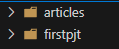

## 프로젝트와 앱

### 프로젝트와 앱

- Django에서 프로젝트와 앱의 관계

  ```mermaid
  flowchart TB
      subgraph Project[Project]
          direction LR
          A[app A] 
          B[app B]
          C[...]
      end
  ```

  - (물리적인 배치라고 생각하면 안 됩니다. 폴더 만들어보면 동일한 선상에 있음)

    

### Django project

- 애플리케이션의 집합
  - DB 설정, URL 연결, 전체 앱 설정 등을 처리

### Django application

- 독립적으로 작동하는 기능 단위 모듈
  - 각자 특정한 기능을 담당
  - 다른 앱들과 함께 하나의 프로젝트를 구성

### 만약 온라인 커뮤니티 카페를 만든다면?

- **프로젝트**: 카페 (전체 설정 담당)
- **앱**: 게시글, 댓글, 회원 관리 등 (DB, 인증, 화면)

### 다양한 서비스에 대입해보면

- **카페 프로젝트**
  - 게시글, 댓글, 회원 관리 앱
- **쇼핑몰 프로젝트**
  - 상품 조회, 배송 조회, 결제 앱
- **교육 관리 프로젝트**
  - 학생 관리, 문제 관리, 점수 관리 앱

---

### 1. 앱 생성

`python manage.py startapp articles`

- ‘articles’라는 폴더와 내부에 여러 파일이 새로 생성됨
- 앱의 이름은 ‘복수형’으로 지정하는 것을 권장

생성되는 파일 구조:

```markdown
📂 articles/
	📂 migrations/
		- __init__.py
		- admin.py
		- apps.py
		- models.py
		- tests.py
		- views.py
```

### 2. 앱 등록

- **why? 프로젝트와 앱은 동일 선상에 폴더가 생기기 때문에 프로젝트가 앱을 추적할 수 없음.**

  

- 반드시 **앱을 생성(1)한 후에 등록(2)** 해야 함 꼭 기억

- 등록 후 생성은 불가

```python
# settings.py
INSTALLED_APPS = [
    'articles',
    'django.contrib.admin',
    'django.contrib.auth',
    'django.contrib.contenttypes',
    'django.contrib.sessions',
    'django.contrib.messages',
    'django.contrib.staticfiles',
]
```

- 등록을 먼저 할 경우,
  생성 명령어 실행 시
  존재하지 않는 `articles` 앱을 찾으려다가 실패함

---

## 프로젝트 및 앱 구조

### 프로젝트 구조 (1/2)

```markdown
📂 firstpjt
	- __init__.py
	- asgi.py
	- **settings.py**
	- **urls.py**
	- wsgi.py
- manage.py
```

- **`settings.py`**
  - 프로젝트의 모든 설정을 관리
- **`urls.py`**
  - 요청 들어오는 URL에 따라 이에 해당하는 적절한 `views`를 연결

**< 나머지는 수업 과정에서 수정할 일 없음 -** 수업은 로컬만 **>**

- `__init__.py`
  - 해당 폴더를 패키지로 인식하도록 설정하는 파일
- `asgi.py`
  - 비동기식 웹 서버와의 연결 관련 설정
    - aws나 google 딴에 연결하기 위해서는 필요할 수 있음.
- `wsgi.py`
  - 웹 서버와의 연결 관련 설정
    - aws나 google 딴에 연결하기 위해서는 필요할 수 있음.
- `manage.py`
  - Django 프로젝트와 다양한 방법으로 상호작용하는 커맨드라인 유틸리티
  - manage.py는 명령만 합니다. 직접적으로 컨트롤 하지는 않게됨.

### 앱 구조 (1/2)

```markdown
📂 articles  
- 📂 migrations  
  - __init__.py  
	- **admin.py**  
	- apps.py  
	- **models.py**  
	- tests.py  
	- **views.py**
```

- **`admin.py`**
  - 관리자용 페이지 설정
- **`models.py`**
  - DB와 관련된 `Model`을 정의
  - MTV 패턴의 **M**
- **`views.py`**
  - HTTP 요청을 처리하고 해당 요청에 대한 응답을 반환
  - `url`, `model`, `template`과 연동
  - MTV 패턴의 **V**