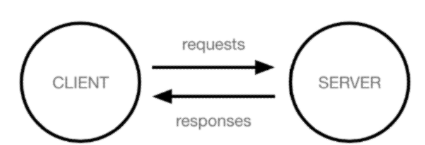
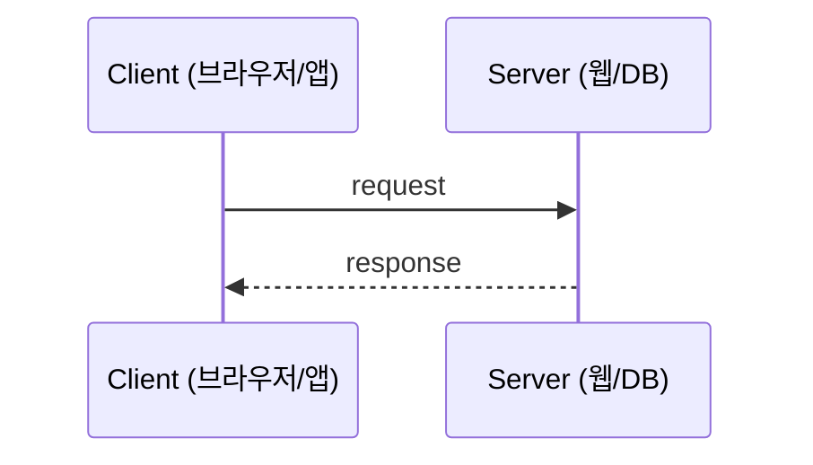
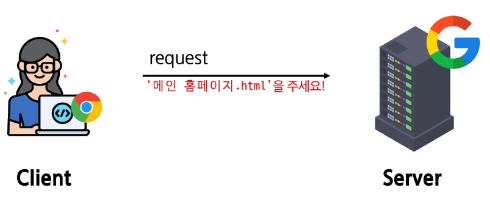

### Web application (web service) 개발

- 인터넷을 통해 사용자에게 제공되는 소프트웨어 프로그램을 구축하는 과정
- 다양한 디바이스(모바일, 태블릿, PC 등)에서 웹 브라우저를 통해 접근하고 사용할 수 있음

> 네이버를 비롯한 포털, 쿠팡과 같은 인터넷 쇼핑몰부터
>
>
> Google Docs와 같은 웹 문서 작업 도구 등 - 인터넷을 통해 접할 수 있으며
>
> 이를 통해 제공되는 서비스를 통틀어 Web Service라고 부릅니다.

### 웹의 동작 방식

우리가 컴퓨터 혹은 모바일 기기로 웹 페이지를 보게 될 때까지 무슨 일이 일어날까?

### 클라이언트 - 서버 구조

- **Client**: 서비스를 요청하는 주체
  - 사용자의 웹 브라우저, 모바일 앱
- **Server**: 클라이언트의 요청에 응답하는 주체
  - 웹 서버, 데이터베이스 서버

> 일반적인 웹 서비스에서는 클라이언트가 페이지를 “요청”하면 서버가 페이지를 “응답”합니다.

### 우리가 웹 페이지를 보게 되는 과정 (1/4)

1. 웹 브라우저(**클라이언트**)에서 `google.com`을 입력 후 Enter

   

- **Client**: 사용자가 브라우저에서 `google.com` 입력
- **Server**: 구글 서버

1. 웹 브라우저는 인터넷에 연결된 전세계 어딘가에 있는
   구글 컴퓨터(**서버**)에게 `메인 홈페이지.html` 파일을 달라고 요청

    

- **Client**: request → “메인 홈페이지.html을 주세요!”
- **Server**: 구글 서버

> 💡 HTML: 웹 페이지의 의미와 구조를 정의하는 언어

1. 요청을 받은 구글 컴퓨터는 데이터베이스에서`메인 홈페이지.html` 파일을 찾아 응답

- **Client**
  - request → 서버에 `메인 홈페이지.html` 요청
  - response ← 서버로부터 `메인 홈페이지.html` 수신
- **Server**: 구글 서버

1. 웹 브라우저는 전달받은 `메인 홈페이지.html` 파일을
   사람이 볼 수 있도록 해석해주고 사용자는 구글의 메인 페이지를 보게 됨

    

- **Client**
  - response ← `메인 홈페이지.html`
  - 브라우저가 HTML을 해석 → 사용자에게 페이지 표시
- **Server**: 구글 서버