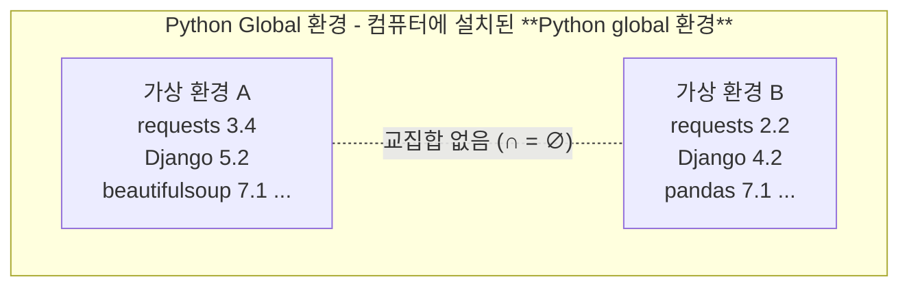

## 가상환경

### 가상 환경 (Virtual Environment)

하나의 컴퓨터 안에서 또 다른 **‘독립된’** 파이썬 환경

> 같은 집 안에 방을 따로 만들어 두고, 필요한 물건들을
>
>
> 각 방에만 들어놓는 것과 비슷합니다.
>
> 각 방의 물건은 서로 간섭하지 않게 됩니다.

> 작은 컴퓨터 하나를 잘 생성하는 느낌!!

왜 필요할까? 구체적으로

### 가상 환경이 필요한 시나리오 1

1. 한 개발자가 2개의 프로젝트(A와 B)를 진행해야 하는 상황
2. 프로젝트 A는 requests 패키지 버전 1이 필요
3. 프로젝트 B는 requests 패키지 버전 2이 필요
4. 하지만 파이썬 환경에서 패키지는 1개의 버전만 존재할 수 있음
5. A와 B의 프로젝트의 다른 패키지 버전 사용을 위한 **독립적인 개발 환경**이 필요

> 패키지: 연관된 모듈들을 하나의 디렉토리에 모아놓은 것

### 가상 환경이 필요한 시나리오 2

1. 한 개발자가 2개의 프로젝트(A와 B)를 진행해야 하는 상황
2. 프로젝트 A는 water라는 패키지가 필요
3. 프로젝트 B는 fire라는 패키지가 필요
4. 하지만 파이썬 환경에서 water 패키지와 fire 패키지를 함께 사용하면
   충돌이 발생하기 때문에 설치할 수 없다고 함
5. A와 B의 프로젝트의 패키지 충돌을 피하기 위해 각각 **독립적인 개발 환경**이 필요

> **독립적이다. 간섭하지 않는다. 충돌나지 않는다. ← kick**

### Python 환경 구조 예시

> Python global: 컴퓨터 전체에서 사용되는 기본 Python 환경을 지칭

**~~이게 venv의 한계~~**

**~~conda는 언어(인터프리터) 버전도 지정해서 만들 수 있음.~~**

**~~python 글로벌 환경 무시 가능!!!@!!!!~~**

### 가상 환경 비유

- 같은 집(컴퓨터) 안에, 방(가상 환경)을 따로 만들어 두고,
- 필요한 물건(라이브러리, 패키지 등)을 그 방에만 들여놓는 것과 유사
- 방이 다르면 들여놓은 물건이 달라도 서로 간섭하지 않음